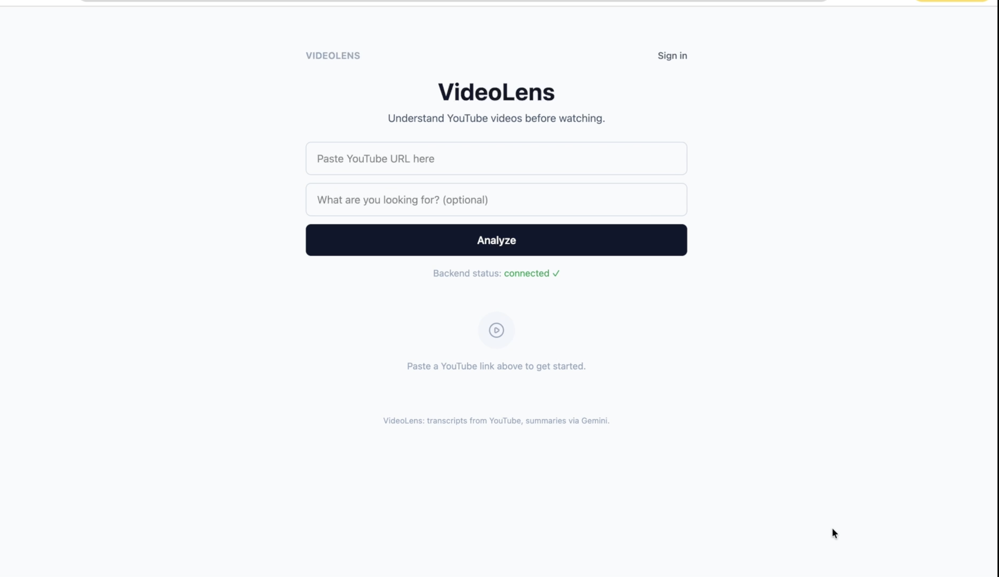
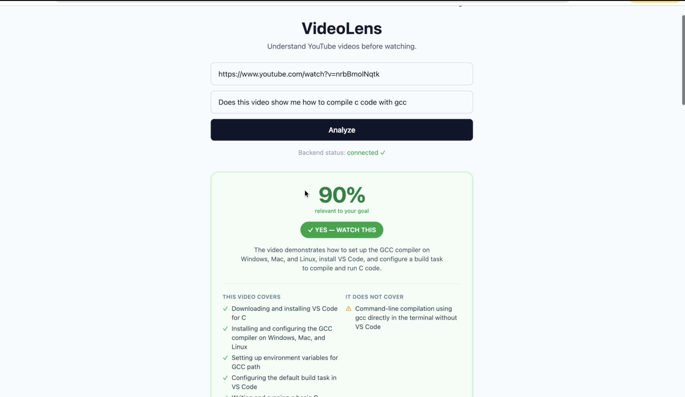
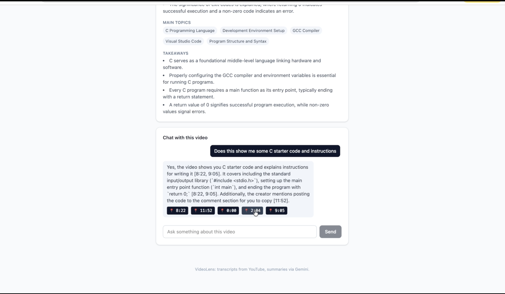
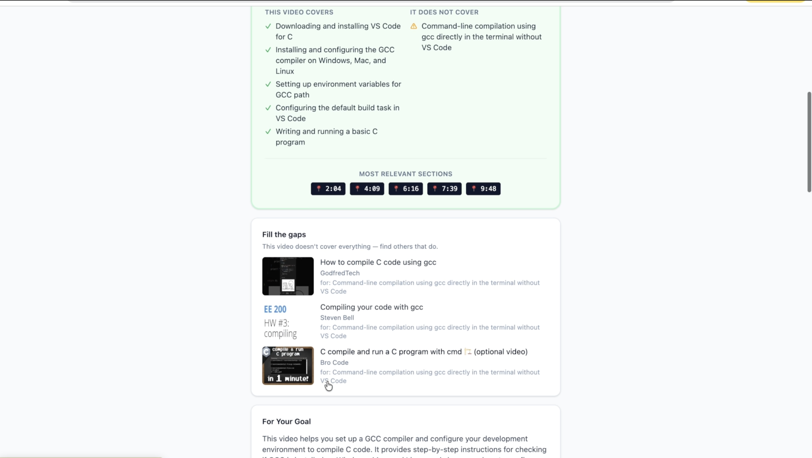

# VideoLens

Paste a YouTube link, tell it what you're looking for, and find out if the video
actually covers it — before you spend time watching.

## Demo 

[▶ Watch the demo video](https://drive.google.com/file/d/1vIpIqAUYnWCY8QJRtw4Z6-neOzRiVHZq/view?usp=sharing)
[▶ Download the demo video](assets/videolens-demo.mp4)


## Features
- Video metadata + transcript retrieval
- AI-generated summaries (overview, key points, topics, takeaways)
- Personalized relevance scoring against a stated goal
- RAG-powered chat grounded in the video's transcript, with timestamp jump-links
- Accounts, saved videos, and history via Clerk
- "Fill the gaps" — finds other videos covering what this one misses

## Stack
- **Frontend:** React, TypeScript, Vite, Tailwind CSS
- **Backend:** FastAPI, SQLAlchemy (async), Pydantic
- **AI:** Google Gemini (generation + embeddings)
- **Database:** PostgreSQL + pgvector
- **Auth:** Clerk

## Local setup

### Backend
```bash
cd backend
python3 -m venv venv
source venv/bin/activate
pip install -r requirements.txt
cp .env.example .env   # fill in your keys
uvicorn app.main:app --reload --port 8000
```

### Frontend
```bash
cd frontend
npm install
cp .env.example .env   # fill in your keys
npm run dev
```

### Database
```bash
docker run --name videolens-postgres \
  -e POSTGRES_USER=videolens \
  -e POSTGRES_PASSWORD=videolens \
  -e POSTGRES_DB=videolens \
  -p 5432:5432 \
  -d pgvector/pgvector:pg16
```

## Required API keys
- `YOUTUBE_API_KEY` — [Google Cloud Console](https://console.cloud.google.com)
- `GEMINI_API_KEY` — [Google AI Studio](https://aistudio.google.com/apikey)
- `CLERK_SECRET_KEY` / `VITE_CLERK_PUBLISHABLE_KEY` — [clerk.com](https://clerk.com)

## Citations
Feature creation supported by Claude.

## Known Limitations

### Transcript retrieval on the deployed backend

VideoLens uses `youtube-transcript-api`, an open-source library that fetches
transcripts without needing an API key. This works reliably when running the
backend **locally**, but YouTube actively blocks requests from IP ranges
belonging to major cloud providers (AWS, GCP, Azure, and by extension most
PaaS platforms built on them, including Render). As a result:

- Running the backend locally (`uvicorn app.main:app --reload`) → transcript
  retrieval works normally.
- Running the backend on the live Render deployment → transcript retrieval
  may fail with a `RequestBlocked` / `IpBlocked` error, since Render's IPs
  fall into a range YouTube blocks.

This is a known, widely-documented limitation of the library itself (see the
["Working around IP bans"](https://github.com/jdepoix/youtube-transcript-api?tab=readme-ov-file#working-around-ip-bans-requestblocked-or-ipblocked-exception)
section of its README), not a bug specific to this project. The maintainer's
recommended fix is routing requests through a rotating residential proxy
(e.g., [Webshare](https://www.webshare.io/)) — note that Webshare's *free*
tier only provides datacenter proxies, which are blocked the same way, so a
paid residential plan is required for this to actually work in production.

**Workaround paths, if reliable production transcript retrieval is needed:**
1. Add a paid rotating residential proxy (Webshare or similar) and configure
   `youtube-transcript-api` to route through it.
2. Switch to a managed transcript API service (e.g., Supadata, TranscriptAPI)
   that handles this at the infrastructure level.
3. Run the backend on your own residential connection / self-hosted machine
   rather than a cloud PaaS.

For this project's scope, the limitation is left undocumented-but-known
rather than fixed, since fixing it requires an ongoing paid dependency.

## Screenshots





